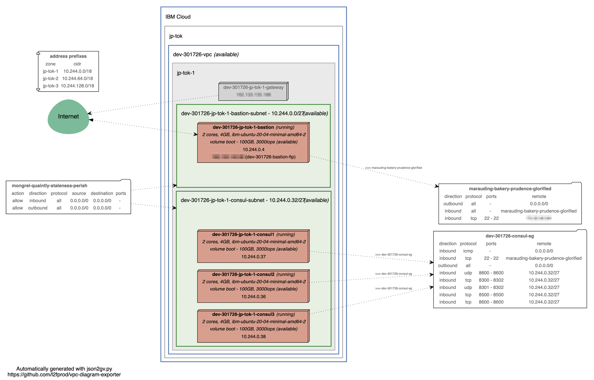

# Status
Terraform validation when using an existing VPC
[](https://github.com/cloud-design-dev/IBM-Cloud-VPC-Consul-Cluster/actions/workflows/existing-vpc.yml)

Terraform validation when creating a new VPC
[](https://github.com/cloud-design-dev/IBM-Cloud-VPC-Consul-Cluster/actions/workflows/new-vpc.yml)

# Deploy a Consul cluster to an IBM Cloud VPC using Terraform and Ansible

## Prerequisites for **all** deployment options
The following information will be needed for each of the deployment options.  

 - An [IBM Cloud API Key]()
 - A Consul [Encrypt Key](https://www.consul.io/docs/agent/options#_encrypt). This is the secret key to use for encryption of Consul network traffic. See [Generate Consul Encrypt Key](#generate-consul-encrypt-key) for running the `keygen` command.

### Prerequisites for Deployment Option 1: Local Terraform deployment

 - [Terraform]() installed. This will deploy the required infrastructure.
 - [Ansible]() installed. This will configure our Consul instances.  
 - [Docker]() installed. We will use a Consul Docker image to generate our consul gossip key..

### Prerequisites for Deployment Option 2: Local bxshell deployment 
If you would like to use an IBM Cloud friendly Docker image in order to not interfere with locally installed versions of the required tools, I recommend using [bxshell](https://github.com/l2fprod/bxshell)

 - [Docker]() installed. We will use a Consul Docker image to generate our consul gossip key.
 - [bxshell](https://github.com/l2fprod/bxshell#install) installed. 

### Generate Consul Encrypt Key
If you have [Docker]() installed

```sh
docker run -it consul:latest consul keygen
```

## Deploy all resources
1. Clone repository:
    ```sh
    git clone https://github.com/cloud-design-dev/IBM-Cloud-VPC-Consul-Cluster.git
    cd IBM-Cloud-VPC-Consul-Cluster
    ```
1. Copy `terraform.tfvars.template` to `terraform.tfvars`:
   ```sh
   cp terraform.tfvars.template terraform.tfvars
   ```
1. Edit `terraform.tfvars` to match your environment.
1. Run `tfswitch` to point to the right Terraform version for this solution:
   ```
   tfswitch
   ```
1. Deploy all resources:
   ```sh
   terraform init
   terraform plan -out default.tfplan 
   terraform apply default.tfplan
   ```

After the plan completes we will move on to deploying Consul using Ansible. 

## Run Ansible playbook to create the consul cluster
```sh
cd ansible 
ansible-playbook -i inventory playbooks/consul-cluster.yml
```

## Verify that the cluster is running
Since we bound the Consul agent to the main private IP of the VPC instances we first need to set the environmental variable for CONSUL_HTTP_ADDR. Take one of the consul instance IPs and run the following command:

```shell
ansible -m shell -b -a "consul members" CONSUL_INSTANCE_NAME -i inventory
```

### Example output
```shell
ansible -m shell -b -a "CONSUL_HTTP_ADDR=\"http://10.241.0.36:8500\" consul members" dev-011534-us-east-1-consul1 -i inventory
dev-011534-us-east-1-consul1 | CHANGED | rc=0 >>

Node                          Address           Status  Type    Build  Protocol  DC       Segment
dev-011534-us-east-1-consul1  10.241.0.36:8301  alive   server  1.9.0  2         us-east  <all>
dev-011534-us-east-1-consul2  10.241.0.38:8301  alive   server  1.9.0  2         us-east  <all>
dev-011534-us-east-1-consul3  10.241.0.37:8301  alive   server  1.9.0  2         us-east  <all>
```

### Asciinema recording 
[](https://asciinema.org/a/376553)

## Diagram

