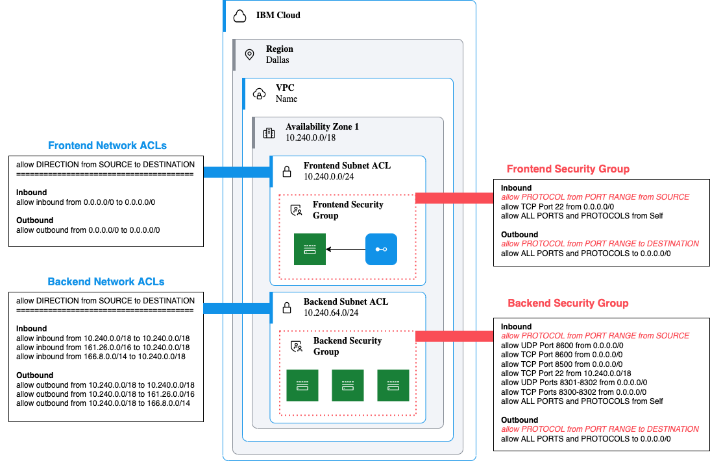

# Overview

**Major reqwrite in progress**

I am on the process of updating this example to use IBM Cloud Terraform modules as well as using ACLs to further segment the network. This guide will also be updated to use Packer to create a custom image with Consul installed. (this keeps us form having to open traffic on the backend ACL to the internet to grab the Consul apt key and binary)

## Diagram

